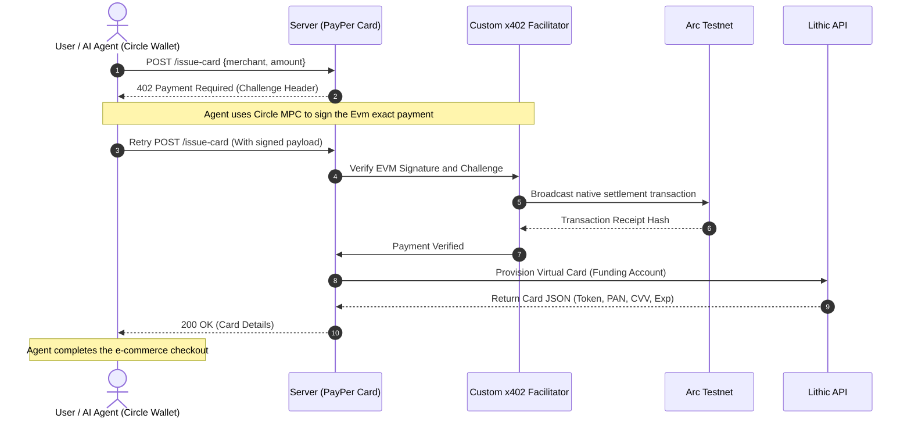

# PayPer Card

Ever wanted your AI agent to autonomously purchase something for you with crypto? Giving an autonomous script your real credit card is risky, and traditional fiat gateways like Stripe require human-in-the-loop KYC or email signups that break agent workflows.

PayPer Card solves this. It allows autonomous AI agents to instantly provision single-use virtual credit cards to complete purchases. There is no KYC, no fiat checkout, and no email signup.

Instead, the system uses the x402 Protocol. Every virtual card request demands a cryptographic payment over the Arc EVM network. Your agent pays in crypto, and our API hands back a real, spendable Visa or Mastercard.

## How it Works

The system bridges web3 machine-to-machine payments with web2 fiat rails by combining Lithic (for instant virtual card issuing), the x402 protocol, and Circle Developer-Controlled Wallets.

When an agent requests a card, the server issues a 402 Payment Required challenge. The agent automatically negotiates this challenge, signs the payment, and the transaction is settled on the Arc Testnet. Once verified, the server provisions the card.

### Custom Arc Facilitator

Traditional x402 facilitators often rely on heavy infrastructure like OpenZeppelin Defender. However, when dealing with new or entirely unsupported Layer 2 testnets like Arc, relying on third-party relayers creates deployment bottlenecks.

To solve this, we built a custom, lightweight facilitator directly utilizing the core x402 module. Instead of proxying through a third-party relay, our custom server natively processes EVM signatures and directly broadcasts settlement parameters onto the Arc Testnet using viem.

### Circle Developer-Controlled Wallets

We integrated Circle's Developer-Controlled Wallets to handle the agent's funds securely. Using Circle's MPC (Multi-Party Computation) technology, the agent gets a programmable wallet where private keys are never exposed. We wrapped viem's signing methods to proxy requests directly to Circle's infrastructure. The agent's wallet is initially funded by the user, allowing it to seamlessly pay the facilitator's 402 challenges entirely on its own.

## Flow Diagram

## Features

- True Machine-to-Machine Payments: Uses the x402 HTTP status code standard. Agents natively understand they need to pay.
- Custom L2 Facilitator: Natively supports the Arc Testnet without relying on bulky relayers.
- Secure Agent Wallets: Powered by Circle's MPC wallets so private keys are never exposed in the execution environment.
- Merchant Locked & Single-Use: Cards can be strictly constrained to specific merchants or locked after a single transaction to prevent subscription theft.

## Getting Started

### Prerequisites

You will need a Lithic Sandbox account for card issuing and Circle Developer-Controlled Wallet API keys for the agent infrastructure.

### Local Installation

1. Copy .env.example to .env and fill in your Lithic API keys, Circle config, and server keys.
2. Install dependencies:
   npm install
3. Start the server:
   npm start
4. Run the client agent:
   npx ts-node client.ts

Built for a future where agents handle the boring stuff.
