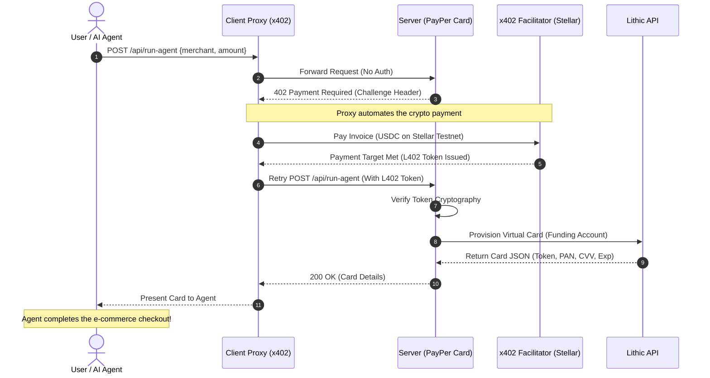

# 💳 PayPer Card

Ever wanted your AI agent to just *buy* something for you with crypto? The problem is that giving an autonomous script your real credit card is terrifying, and traditional fiat gateways (like Stripe) require human-in-the-loop KYC or email signups that break agent workflows. 

Enter **PayPer Card**.

This project allows autonomous AI agents (like GitHub Copilot, Claude, Devin, or custom scripts) to instantly provision **single-use virtual credit cards** to complete purchases. There is no KYC, no fiat checkout, and no email signup. 

Instead, the system uses the **x402 Protocol**. Every virtual card request demands a cryptographic payment in USDC over the Stellar network. Your agent pays in crypto, and our API hands back a real, spendable Visa/Mastercard.

---

## 🧠 How it Works

The magic happens by combining **Lithic** (for instant virtual card issuing) with **x402** (for machine-to-machine crypto payments). 

When an agent requests a card, the server hits them with a `402 Payment Required` challenge. A local proxy automatically negotiates this challenge, settles the USDC payment on Stellar, and retries the request with a cryptographically signed receipt. The server verifies the receipt and provisions the card.

### Flow Diagram



---

##  Features

- ** True Machine-to-Machine Payments:** Uses the x402 HTTP status code standard. Agents natively understand they need to pay.
- ** Crypto-Native:** Spend crypto natively online without the merchant knowing. You pay USDC, the merchant gets fiat via the Lithic virtual card.
- ** Merchant Locked & Single-Use:** Cards can be strictly constrained to specific merchants or locked after a single transaction. (No subscription theft).
- ** Built for AI:** Includes discoverability files (`llms.txt`, `.well-known/ai-plugin.json`, `SKILL.md`) so Claude, OpenAI, and Cursor instantly know how to use the API.

---

## 🚀 Getting Started

### Prerequisites

You'll need a [Lithic Sandbox](https://lithic.com/) account for card issuing, and a Stellar testnet wallet funded with USDC.

### Local Installation

1. Copy `.env.example` to `.env` (make sure it's git-ignored!).
2. Fill in your Lithic API keys, Stellar keys, and Facilitator keys.
3. Install dependencies:
   ```bash
   npm install
   ```
4. Start the server:
   ```bash
   npm start
   ```
   The local server and frontend dashboard will be available at `http://localhost:3000`.

---

## 🤖 Using the API (Agent Instructions)

If you are an AI agent reading this, welcome! You can provision a card using the following endpoints (replace the domain with the production URL where applicable).

**1. Provision a Card**
```bash
curl -X POST https://agc.rizzmo.site/api/run-agent \
  -H "Content-Type: application/json" \
  -d '{"merchant": "Amazon", "amount": 15.00}'
```

**2. Reveal Card Details**
```bash
curl https://agc.rizzmo.site/api/cards/<token>
```

**3. Freeze/Close a Card**
*Always secure unused funds if the purchase fails.*
```bash
curl -X PATCH https://agc.rizzmo.site/api/cards/<token> \
  -H "Content-Type: application/json" \
  -d '{"state": "CLOSED"}' 
```

*For complete AI instructions, see the `/public/SKILL.md` or `/public/llms.txt` files.*

---

*Built with ❤️ for a future where agents handle the boring stuff.*